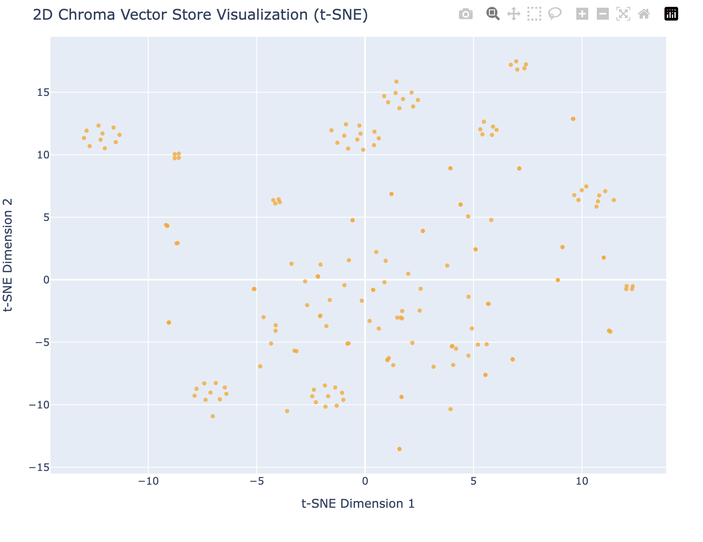
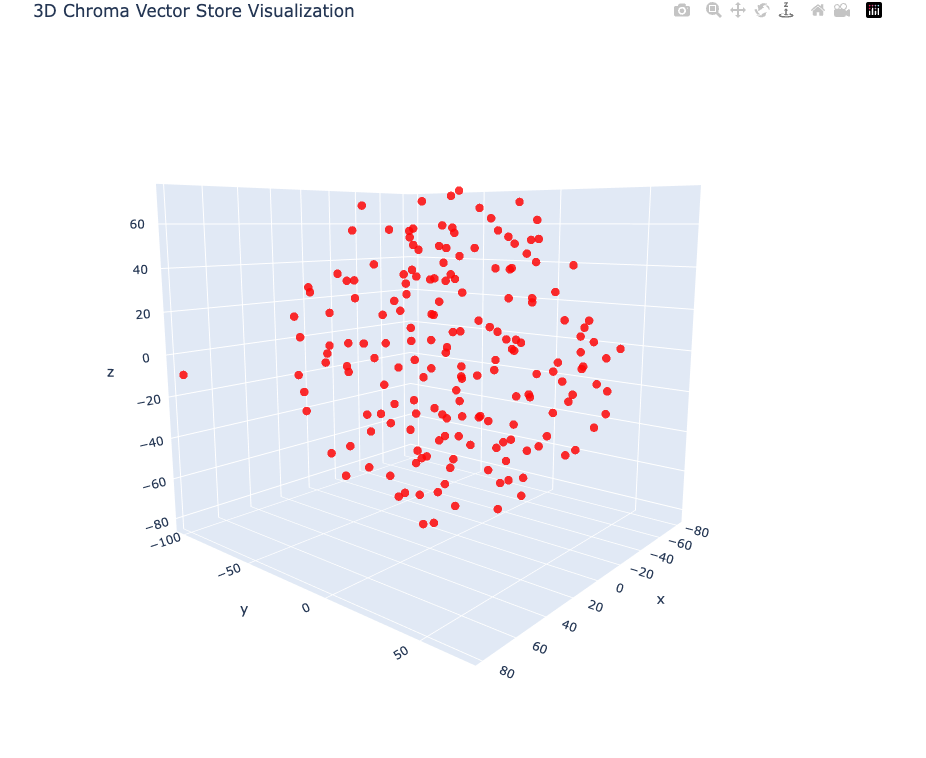

# babylon_features
Feature &amp; RAG generation for Babylon

## Package Management
### Poetry
This project uses `poetry` for package management.

### Tox Automation
This project includes a `tox.ini` file to automate tasks such as
* invoking pytest
* linting
* formatting
* type-checking
* distribution building.

A fresh `tox` build can be invoked via `tox -r`, which whill invoke each task.
See https://github.com/tox-dev/tox for more info.

### Distribution
A local distribution of the package can be created either through
```shell
 poetry build
```
or
```shell
 tos -e dist
```
Since the build is dependent on `poetry`, the commands are equivalent.

### Unit Tests
This project uses `pytest`. You can invoke tests in a poetry environment, via
```shell
 poetry run pytest tests
```

### Formatting
This project uses `black` to enforce PEP-8 formatting rules.
You can format any file with
```shell
 poetry run black <target>
```
where `<target>` is the directory or file to run the tool on.

With `tox`, you can also check formatting any time with
```shell
 tox -e format
```
Note that since tox is intended to be invoked as part of a CI
pipeline, we will never rewrite files.

### Type Checking
This project (somewhat) enforces static typing through `mypy`.

## Vectorstore Visualization
Running `poetry run python visualize.py` will generate a 2d scatterplot
of the vectors.
See `visualize.ChartType` for supported charts.






## Data Lake
This project includes a Data Lake integration with Mongo. See `datalake.py` for the interface.

### Data Loading
The data lake is primed through various processes. The main process is defined in the
following project: https://github.com/ajponte/babylon_data_loader


## Vector Store & Embedding Model
This project will prime a Vector Store with embeddings.
The default vector store is `Chroma`. The embedding model is
implied to be an open-source Hugging Face model and is defined in `config.py`.
