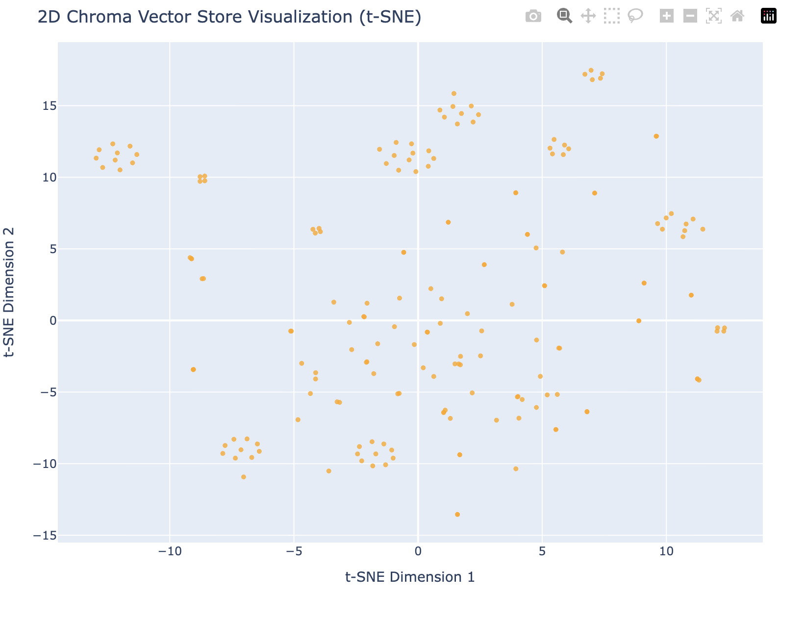
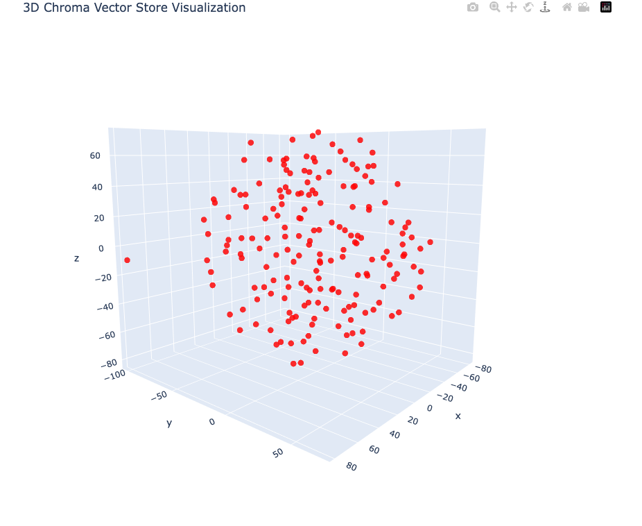

# babylon_features
Feature &amp; RAG generation for Babylon

## Data Lake
The pipeline depends on a mongo data source. Data for babylon is loaded via
the [Data Loader Go Routine](https://github.com/ajponte/babylon_data_loader)

## Daemon
The script `daemon.py` can be used to instantiate a new daemon process.
The script was designed in a way such that it loads required configurations
from the running environment (ie in a Docker container).

## Package Management
### Poetry
This project uses `poetry` for package management.

### Tox Automation
This project includes a `tox.ini` file to automate tasks such as
* invoking pytest
* linting
* formatting
* type-checking
* distribution building.

A fresh `tox` build can be invoked via `tox -r`, which whill invoke each task.
See https://github.com/tox-dev/tox for more info.

### Distribution
A local distribution of the package can be created either through
```shell
 poetry build
```
or
```shell
 tox -e dist
```
Since the build is dependent on `poetry`, the commands are equivalent.

### Artifact Deployment
This project can be built as a Zip module artifact for deployment. The artifact includes the `features/` package.

To build the artifact locally:
```shell
tox -e dist
```
This will create `babylon-features.zip` in the root directory, along with standard poetry distribution files in `dist/`.

### CI/CD
The project uses GitHub Actions for CI/CD, leveraging a modular architecture for efficiency and maintainability.

- **babylon-features**: A modular CI pipeline that runs on every push and pull request to `main`. It is split into parallel jobs to provide faster feedback:
    - **lint**: Performs static analysis using `pylint`.
    - **format**: Verifies PEP-8 compliance using `black`.
    - **typecheck**: Enforces static typing via `mypy`.
    - **test**: Executes the test suite using `pytest`.
- **Babylon Features Artifact CD**: An automation pipeline triggered by version tags (e.g., `v*`) or manual dispatch. It builds a distribution and a ZIP artifact (`tox -e dist`) and uploads them to GitHub Releases.

#### Reusable Actions
To ensure consistency across workflows, shared setup logic is encapsulated in a local composite action:
- **.github/actions/setup-tox**: Handles Python environment setup, caches the `.tox` directory for faster subsequent runs, and installs core dependencies (`tox`, `poetry`).

To manually trigger a deployment and upload to GitHub:
```shell
python artifact_upload.py --repo <owner>/<repo> --tag <tag>
```
Ensure `BABYLON_API_GITHUB_PAT_TOKEN` is set in your environment.


### Unit Tests
This project uses `pytest`. You can invoke tests in a poetry environment, via
```shell
 poetry run pytest tests
```

### Formatting
This project uses `black` to enforce PEP-8 formatting rules.
You can format any file with
```shell
 poetry run black <target>
```
where `<target>` is the directory or file to run the tool on.

With `tox`, you can also check formatting any time with
```shell
 tox -e format
```
Note that since tox is intended to be invoked as part of a CI
pipeline, we will never rewrite files.

### Type Checking
This project (somewhat) enforces static typing through `mypy`.

## Vector Databases
The pipeline supports multiple vector database technologies through a common `VectorStore` abstraction. Currently, **Chroma** and **Qdrant** are supported.

### Configuration
The choice of vector database is controlled by the `VECTOR_DB_TYPE` environment variable.

| Variable | Description | Default |
|----------|-------------|---------|
| `VECTOR_DB_TYPE` | Type of Vector DB (`chroma` or `qdrant`) | `chroma` |
| `EMBEDDING_MODEL` | HuggingFace embedding model to use | `BAAI/bge-small-en-v1.5` |

#### Chroma Settings
Used when `VECTOR_DB_TYPE=chroma`.
* `CHROMA_SQLITE_DIR`: Directory for SQLite persistence.
* `EMBEDDINGS_COLLECTION_CHROMA`: Name of the Chroma collection.

#### Qdrant Settings
Used when `VECTOR_DB_TYPE=qdrant`.
* `QDRANT_HOST`: Hostname of the Qdrant service.
* `QDRANT_PORT`: Port of the Qdrant service (default: `6333`).
* `QDRANT_COLLECTION`: Name of the Qdrant collection.

## Vectorstore Visualization
Running `poetry run python visualize.py` will generate a 2d scatterplot
of the vectors.
See `visualize.ChartType` for supported charts.





# Gemini Agent Configuration

The `gemeni` directory contains the configuration files for the Gemini agent.

- `config.yaml`: Main configuration for the agent.
- `commands.yaml`: Defines the commands that the agent can execute.
- `prompts.yaml`: Stores the prompts that the agent will use.
